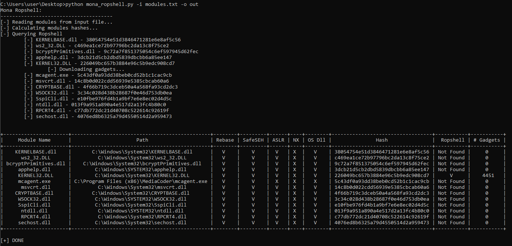

# mona-ropshell
Mona_ropshell adds [Ropshell DB](http://ropshell.com/about) supports to [Mona](https://github.com/corelan/mona). Given a list of loaded modules (DLLs), it calculate DLLs hashes and compare them querying Ropshell DB. If any results is found, it fetch ROP gadgets, downloading them in the current folder. It also generate a nice recap :)



### Usage
Feed mona_ropshell.py with a file cointaining the results of !mona modules command execution (see input.txt sample)
```
mona_ropshell.py -i modules_list.txt -o output.txt
```
### Sample Output
```
+----------------------+-----------------------------------------------+--------+---------+------+----+--------+----------------------------------+-----------+-----------+
|     Module Name      |                      Path                     | Rebase | SafeSEH | ASLR | NX | OS Dll |               Hash               |  Ropshell | # Gadgets |
+----------------------+-----------------------------------------------+--------+---------+------+----+--------+----------------------------------+-----------+-----------+
|    KERNELBASE.dll    |       C:\Windows\System32\KERNELBASE.dll      |   V    |    V    |  V   | X  |   V    | 38054754e51d3846471281e6e8af5c56 | Not Found |     0     |
|      ws2_32.DLL      |         C:\Windows\System32\ws2_32.DLL        |   V    |    V    |  V   | X  |   V    | c469ea1ce72b97796bc2da13c8f75ce2 | Not Found |     0     |
| bcryptPrimitives.dll |    C:\Windows\System32\bcryptPrimitives.dll   |   V    |    V    |  V   | X  |   V    | 9c72a7f851375054c6ef597945d62fec | Not Found |     0     |
|     apphelp.dll      |        C:\Windows\SYSTEM32\apphelp.dll        |   V    |    V    |  V   | X  |   V    | 3dcb21d5cb2dbd5839dbcbb6a85ee147 | Not Found |     0     |
|     KERNEL32.DLL     |        C:\Windows\System32\KERNEL32.DLL       |   V    |    V    |  V   | X  |   V    | 226049bc657b3884e96c5b9edc908cd7 |     V     |    4451   |
|     mcagent.exe      | C:\Program Files (x86)\MediaCoder\mcagent.exe |   V    |    V    |  X   | X  |   X    | 5c43df0a93dd38beb0cd52b1c1cac9cb | Not Found |     0     |
|      msvcrt.dll      |         C:\Windows\System32\msvcrt.dll        |   V    |    V    |  V   | X  |   V    | 14c8b0d022cdd56939e5385cbcab60a6 | Not Found |     0     |
|    CRYPTBASE.dll     |       C:\Windows\System32\CRYPTBASE.dll       |   V    |    V    |  V   | X  |   V    | 4f66b719c3dceb50a4a568fa93cd2dc3 | Not Found |     0     |
|     WSOCK32.dll      |        C:\Windows\SYSTEM32\WSOCK32.dll        |   V    |    V    |  V   | X  |   V    | 3c34c028d438b28687f0e46d753db0ea | Not Found |     0     |
|     SspiCli.dll      |        C:\Windows\System32\SspiCli.dll        |   V    |    V    |  V   | X  |   V    | e10fbe976fd4b1a9bf7e6e8ec02d4d5c | Not Found |     0     |
|      ntdll.dll       |         C:\Windows\SYSTEM32\ntdll.dll         |   V    |    V    |  V   | X  |   V    | 013f9a951a890a4e517d2a13fc4b80c0 | Not Found |     0     |
|      RPCRT4.dll      |         C:\Windows\System32\RPCRT4.dll        |   V    |    V    |  V   | X  |   V    | c77db772dc21d40708c522614c92619f | Not Found |     0     |
|     sechost.dll      |        C:\Windows\System32\sechost.dll        |   V    |    V    |  V   | X  |   V    | 4076ed8b6325a79d4550514d2a959473 | Not Found |     0     |
+----------------------+-----------------------------------------------+--------+---------+------+----+--------+----------------------------------+-----------+-----------+```
